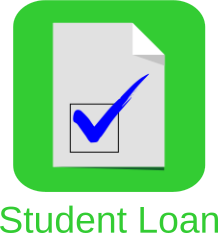

<snippet>
<content>

<link rel="stylesheet" href="https://use.fontawesome.com/releases/v5.0.13/css/all.css" integrity="sha384-DNOHZ68U8hZfKXOrtjWvjxusGo9WQnrNx2sqG0tfsghAvtVlRW3tvkXWZh58N9jp" crossorigin="anonymous">
 
# 

Check your student loan's length of repayment and amount of savings.

This project is a native Android app that is one of two parts of an experimental study&mdash;the other part being [course material](https://gitlab.com/check-student-loans/course-material "Click here to locate the course material."), and it is designed to supplement the course material.
The combination of both parts is dubbed an *instructional app*. Users select an estimated cost, select the interest rate of their loan, and select a monthly payment. 
The app will estimate how long repayments will take and how much users can save by paying more than the minimum.
(This app will not tell you how much money you have loaned. Contact your school's bursar office for that information. Once you have that information, use this app.)

Features:
* Automatic estimation
* Swipe leftward to view how estimates were calculated.

Designed for phones running Android 4.2 (Jelly Bean) or above

Alternative downloads: 
[Version 1.x for Formal Pilot Test](./Archives/formal_pilot_test.apk "Click here to access the download link.") &nbsp; <i class="far fa-check-circle" style="color:rgb(34,181,115)" aria-hidden="true"> No malware</i> [[Details](https://www.virustotal.com/gui/file/c390f6a054cfb699fcc209f671a7ff8df6d2df9d7145642dfa1663c890f07b99/detection)] 
[Version 1.x for Informal Pilot Test](./Archives/informal_pilot_test.apk "Click here to access the download link.")* &nbsp; <i class="far fa-check-circle" style="color:rgb(34,181,115)" aria-hidden="true"> No malware</i> [[Details](https://www.virustotal.com/gui/file/70246579afcb5b944812d34e2b821939a692692a413e5346fcbd5eb9319078fc/detection)] 
[Version 1.x for Focus Groups](./Archives/focus_groups.apk "Click here to access the download link.")* &nbsp; <i class="far fa-check-circle" style="color:rgb(34,181,115)" aria-hidden="true"> No malware</i> [[Details](https://www.virustotal.com/gui/file/70246579afcb5b944812d34e2b821939a692692a413e5346fcbd5eb9319078fc/detection)] 
[Version 1.x - Final](./Archives/final.apk "Click here to access the download link.") &nbsp; <i class="far fa-check-circle" style="color:rgb(34,181,115)" aria-hidden="true"> No malware</i> [[Details](https://www.virustotal.com/gui/file/47a7d6b6a3ab33e5b5a5dd2cbc278d3dc22ef72717fe29638e9de7a33ef44a97/details)]

\* identical

Install alternative downloads directly on phones running Android 4.2 (Jelly Bean) or above.

## Build from Source Code

Download [Android Studio](https://developer.android.com/studio/ "Click here to access the download link.") from Google, and install it. 
(For help with installing the application, follow its [installation instructions](https://developer.android.com/studio/install "Click here to access the instructions.").)

Do not run Android Studio in a virtual machine, though. Run it in a user's host operating system. 
Otherwise, the app may not run successfully or quickly in an Android Virtual Device.

Also, download and install [Git](https://git-scm.com/downloads "Click here to access the download link.").

Open a terminal, and clone the project:
<pre>
git clone https://gitlab.com/check-student-loans/android.git
</pre>

(Recommended) Verify the project's authenticity: Look in GitLab for "Verified" next to the commit SHA (e.g., Verified e733a45d).

(Recommended) Open a terminal, and verify the project's integrity:
<pre>
cd android
git show-ref --heads --hash
</pre>
Check that the hash matches the commit SHA.

Open the project in Android Studio, and build the native app: 
* For a virtual or connected Android phone, select Build > Make Project. 
* Otherwise, select Build > Build APK(s).

## Usage

Run the native app in a virtual device (e.g., Galaxy Nexus with API 28 x86) or on a connected device. 
Or, install the APK file directly on a user's own Android phone.

Move the thumb of the slider, to select an estimated cost nearest to yours. 
Press &#x25BC; to select the [interest rate](https://studentaid.ed.gov/sa/types/loans/interest-rates "Click here to visit the office of Federal Student Aid.") of your loan. 
Press &minus; or &#43; to select a monthly payment nearest to yours.

Known to work in Android Studio 3.4.2 and phones running Android 4.2 (Jelly Bean) or above.

## Contributing

This project has been archived. 
Please contribute to the project's counterpart, which is based on iOS, by going [here](https://gitlab.com/check-student-loans/ios "Click here to access the most recent iOS build.").

## History

Oct 31, 2019: enhanced accessibility 
Sep 25, 2019: unified author name and email of all commits 
Sep 17, 2019: starting signing commits, signed and re-committed old ones, inadvertently lost empty commits but they were empty anyway 
Oct 12, 2018: refreshed entire project but inadvertently purged commit history 
Sep 26, 2018 &middot; Version 1.x: initial commit

## Known Issues

This native app is an alpha build that is outdated. 
Access the native app's most recent build, which is based on iOS, [here](https://gitlab.com/check-student-loans/ios "Click here to access the most recent build.").

## License

MIT License

Copyright (c) 2018-2019 Ed Silkworth

Permission is hereby granted, free of charge, to any person obtaining a copy
of this software and associated documentation files (the "Software"), to deal
in the Software without restriction, including without limitation the rights
to use, copy, modify, merge, publish, distribute, sublicense, and/or sell
copies of the Software, and to permit persons to whom the Software is
furnished to do so, subject to the following conditions:

The above copyright notice and this permission notice shall be included in all
copies or substantial portions of the Software.

THE SOFTWARE IS PROVIDED "AS IS", WITHOUT WARRANTY OF ANY KIND, EXPRESS OR
IMPLIED, INCLUDING BUT NOT LIMITED TO THE WARRANTIES OF MERCHANTABILITY,
FITNESS FOR A PARTICULAR PURPOSE AND NONINFRINGEMENT. IN NO EVENT SHALL THE
AUTHORS OR COPYRIGHT HOLDERS BE LIABLE FOR ANY CLAIM, DAMAGES OR OTHER
LIABILITY, WHETHER IN AN ACTION OF CONTRACT, TORT OR OTHERWISE, ARISING FROM,
OUT OF OR IN CONNECTION WITH THE SOFTWARE OR THE USE OR OTHER DEALINGS IN THE
SOFTWARE.

</content>
</snippet>
